&copy; 2019 Jason Luther. All rights reserved. 

# Home Bocce Court

We built our own home bocce court, and you can too! In this document I will share my experience. A shorter version of this article is available on [Instructables](https://www.instructables.com/id/Homemade-Bocce-Court/). 

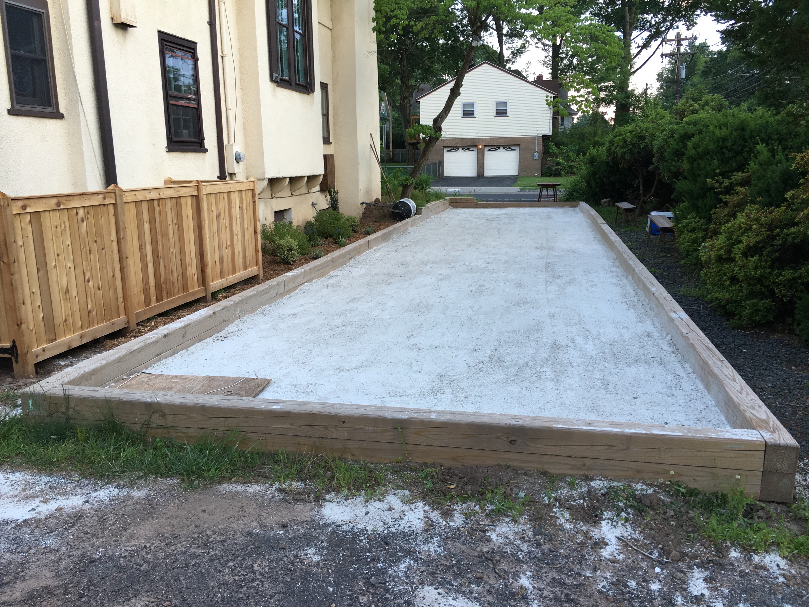

## Should you build your own bocce court?

If you like having parties, spending time with friends, arguing about barely-perceptible differences in distance, drinking wine, doing manual labor, experiencing the thrill of ordering materials by the ton, and dictating your own _house rules_, you definitely should build your own bocce court!

If you aren't so much into the manual labor, you might just want to pay someone else to build a bocce court for you, or you may be interested in a game called _horseshoes_. 

### Do you have the right space for a court?

Depending on who you ask, a regulation court is 60 feet long and 12 feet wide, but it's your court, so make it whatever size you want!

What you ultimately need is level ground. Moving earth can be hard work, and the dirt and debris you move needs to go somewhere. 

### Do you have a lot of free time and/or a lot of friends?

Each step of the process can take a long time because of the sheer amount of material you need to manipulate. Having friendly extra hands will make things move much faster. 

However, you can do most of the construction alone if you have to. 

### You can do it!

A court doesn't have to be fancy or expensive. You can do little more than buy a set of [bocce balls](https://amzn.to/2C1FkCk) and have a great time playing in your sloped back yard. 

As you look around online, you'll see a great variety of court size and complexity, and I am sure their owners are all having fun. 

So decide on your time and money budget, and then use the tools and information described below to get inspired and build the right court for you. 

### Be safe

Any construction project can be dangerous or fatal, so please take appropriate safety precautions and consult a professional when you need help. 

Also be sure to [call 811](http://call811.com/before-you-dig) before you dig in your yard to check for underground utilities.

Use a respirator when cutting wood, especially if it's pressure-treated, and when spreading out dusty materials. Use hearing protection when using power tools. Always wear safety glasses. 

I am not a professional, and I am just sharing my experience for information and entertainment purposes. I cannot be held responsible for any damage or injuries that result from actions you take. 

## Before and After

We live on a corner lot that had a long driveway and overgrown foliage. Here's what it looked like before:

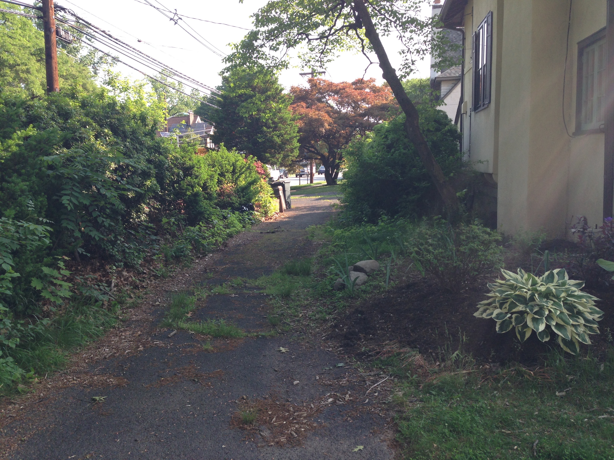 

Here's the bocce court today:

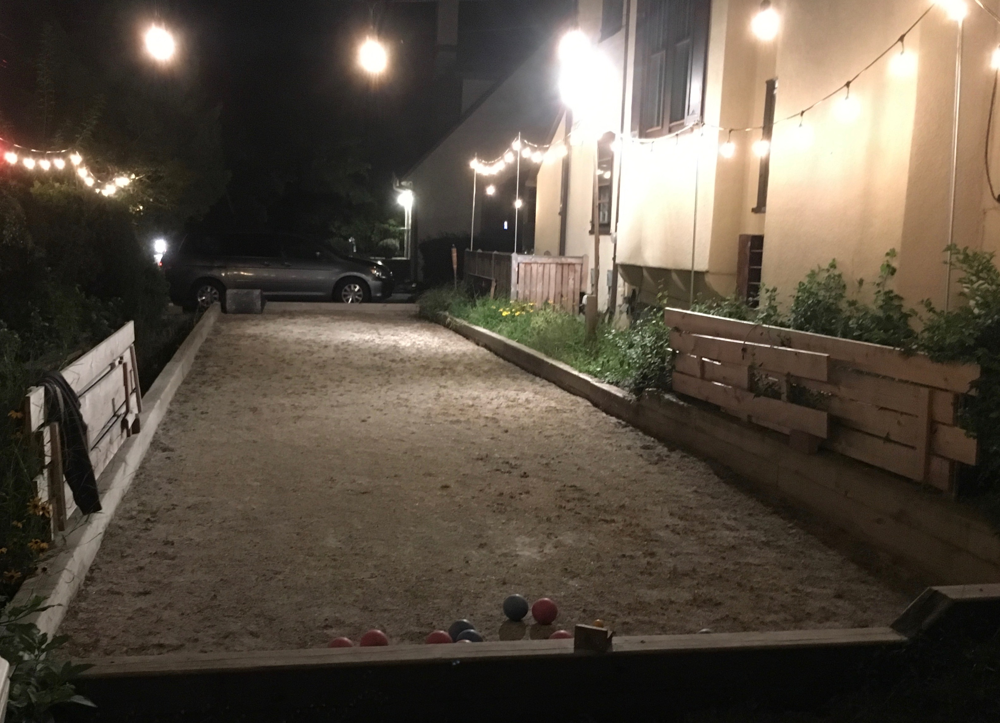

## Overview

Here's the general process I followed:

1. Clear area and level the ground
2. Install drainage layer
3. Lay out wooden border, leaving end off for dump truck access
4. Put down weed barrier
5. Install surface
6. Finalize wooden border
7. Level the surface
8. Top with oyster shells

For extra credit:

1. Build a cabinet to store balls
2. Install lighting
3. Make a scoreboard

## Cost & Materials

The cost of your court will vary based on the overall size, the work required to level the ground, the quality of materials, and how much you decide to invest in drainage. 

You can build a great court with 4x4 timbers and a thin layer of gravel, or you can design a complex drainage system that will let you play soon after a rain storm. 

I spent about $2200 on materials in Northern New Jersey in 2014, including $990 in lumber. 

This project does not require a lot of tools, and most of them are the same basic tools you want for any DIY project or will have as a homeowner: saw, hammer, drill/driver, shovel, rake, and safety gear. 

### Sources

I have included links to some of the materials and tools I used. Some of those are affiliate links, so I may earn a commission on purchases made through those links. 

However, I would much prefer if you bought these things from a local supplier instead of Amazon. With any DIY project, you're going to make multiple trips to the store, and you're going to want advice from experts. 

None of this content is otherwise sponsored.

I buy as much as I can from my local hardware store: [American Royal Hardware](https://ww3.truevalue.com/montclair/Home.aspx) in Montclair, NJ. 

For nicer lumber, I use [Boards and Beams](http://www.woodboardsandbeams.com/) in Fairfield. They post their prices on the website, which is rare. To get prices from most suppliers, you have to use a telephone and talk to a live person.

For construction materials and lumber, I use [West Essex Building Supply](https://www.westessexbuilding.com/) or drive a little further to [84 Lumber](https://www.84lumber.com/). 

For this project, the stone and aglime came from [Braen Stone](https://www.braenstone.com/). 

### Materials

A typical bocce court has a wooden border, a rocky drainage layer, and a playing surface. 

I used pressure treated lumber, but you can choose any material that is suitable for ground contact. I ended up with two courses of 6x6 lumber (11" tall) set a few inches below grade. 

There can be many layers to a bocce court, especially if you invest in good drainage. My court only has four layers (two major):

 * Drainage: 3/4" stone
 * Weed barrier
 * Playing surface: agricultural limestone
 * Top layer: a dusting of crushed oyster shell

#### Volume

At 660 square feet, material quickly adds up to _tons_ or _cubic yards_, and it can be intimidating to purchase from a landscaping supplier who primarily sells to pros. Just call around and ask questions. 

I bought 12 tons of aglime for $30/ton (about 1.5 tons per cubic yard) plus tax and $100 for delivery, for a total of $500. Stone dust would have been less than half the price per yard and is probably what I should have used. 

The 3/4" aggregate base course was about 10 cubic yards (14 tons) for $262 plus tax and delivery. 

Don't be afraid to call up suppliers to ask what materials they recommend for a bocce court in your area. 

## Steps in Detail

### Layout and Leveling

[Call 811](http://call811.com/before-you-dig) before you dig in your yard to check for underground utilities.

After selecting the site, you will need to establish level ground. It doesn't have to be perfect because you'll be putting a drainage layer down that you can make level. Depending on your soil, you can choose to build the wooden border on the soil or on top of your drainage layer. 

I chose to build the border on top of the drainage layer. 

You don't necessarily need to dig down for anything but your wooden border (and you could use boards with stakes to minimize digging), but your surface needs to be at least 4 inches below the top of the border. 

You'll need to find a place for all the earth you move, which can be an undertaking if you are working with a large slope. 

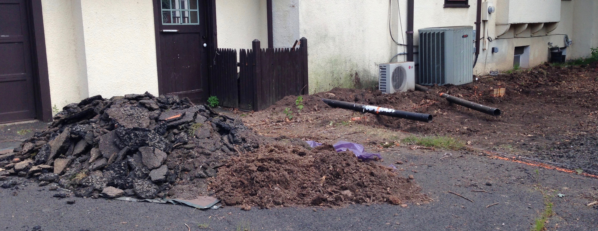

To mark out the space, you'll need a long tape measure. There are many methods for marking out an accurate triangle. My court is next to the house, so I was able to use the house for reference. To check that the layout is square, measure from one corner to the opposite one. That measurement should be the same as the measurement from the other diagonal. 

To get the rough layout, I drove stakes at the corners and ran a string line between the stakes. Then I set more stakes along the string line and spray-painted the ground to mark where to dig. 

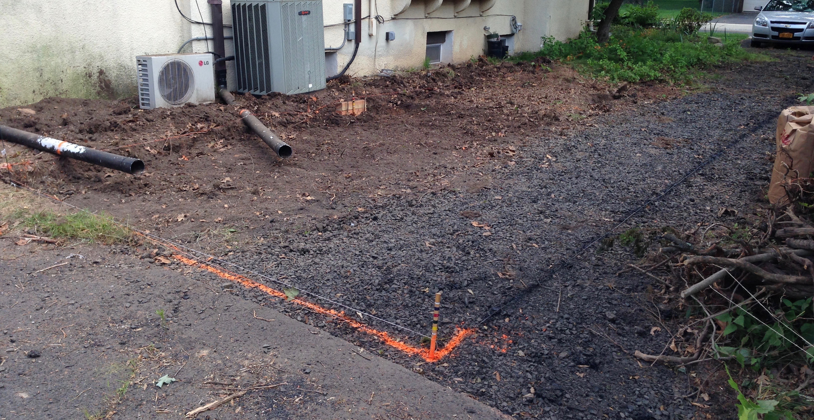

If you don't have an easy reference, you will want to spend more effort on the layout and use batter boards. Plus, there are two advantages to using batter boards: you don't have to move them out of the way when you dig, and you can set your strings to be level so that you have a reference as you dig. 

I used a cheap water level to mark the same height on several stakes around the site and then tried to run a string at that height. 

### Drainage Layer

My drainage layer is about 4 inches of 3/4" aggregate (crushed stone). You might see it described as Class II road base. or just 3/4" stone. 

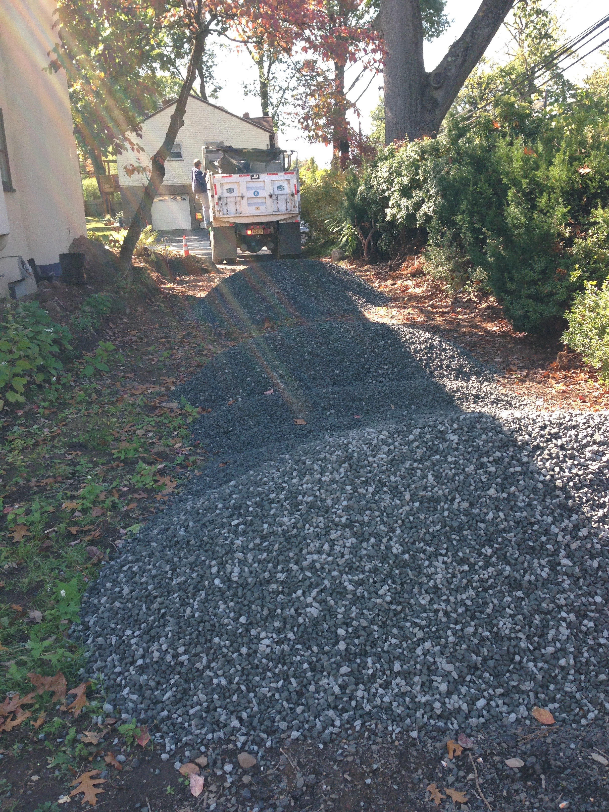

It extends beyond the border of the court by about a foot and is also thinly spread around the side for a walking surface. 

I ordered 10 yards, which is 14 tons. Including tax and delivery, it was just under $400. 

In my yard, I ended up digging down about 4" for the drainage layer, and then the border and the rest of the surface are resting at grade level. 

14 tons of stone is, well, tons of material to move around. Use shovels and a cement rake to spread it out. Then use a long board with a spirit level on top to check out the surface and keep leveling things out. 

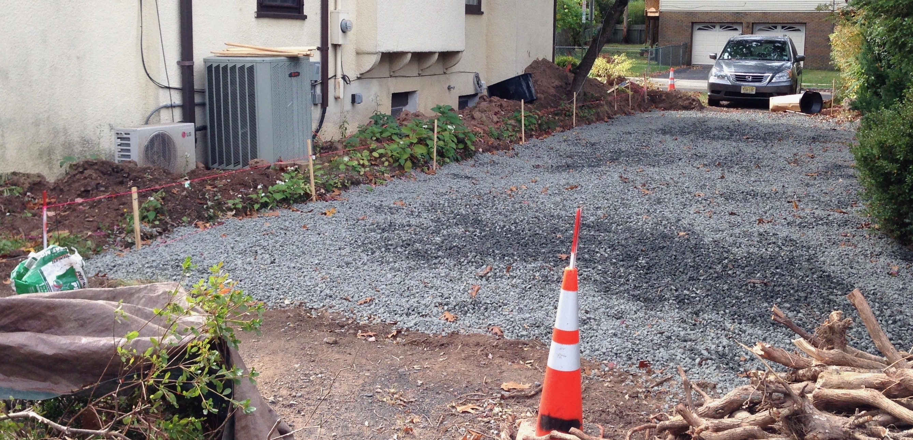

### Border

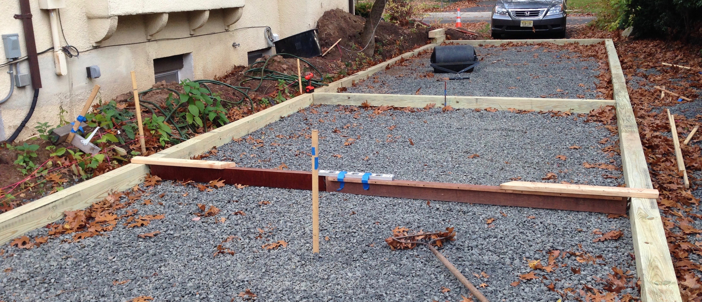

The border consists of two rows of pressure-treated lumber. The top row is offset from the bottom row so that the joints between boards are staggered. 

During construction, I left one of the ends off so that the dump truck delivering the surface material could spread it out across the court. 

I used 6x6 lumber, which is 5 1/2" on each side, which makes the border 11" tall. Each 12' board was $37, and I purchased 25 of them for the project. A small section of the yard required a third course. 

The top of my border is 8" above the surface, but you can get by with less. 

Each board on the bottom row is secured to the ground using 3-1/2' sections of 1/2" rebar. I had the lumber yard cut it for me, but it's really easy to cut using an [angle grinder](https://amzn.to/2zWU6c7) with a cutoff wheel. Drill a 1/2 hole near each end of the board and then drive the rebar into the ground with a hammer. You may need a [small sledgehammer](https://amzn.to/2C1K9vC) if you encounter rocks or have tough soil. 

The top course is secured to the bottom course using [8" TimberLOK screws](https://amzn.to/2Ol9CGF). You'll need a decent drill/driver to drive these in. My old cordless drill wasn't sufficient, so I used a corded drill. A modern [cordless impact driver](https://amzn.to/2ymm27v) will work fine. You might also consider pre-drilling the holes. 

The way the dimensions worked out, I wasn't able to interleave the ends, but it would be a good idea. 

I used a [circular saw](https://amzn.to/2IHGRyX) to cut the lumber. Use a [speed square](https://amzn.to/2yhrnN2) (also called a framing or rafter square) as a straightedge. You'll have to make a cut, rotate the board, repeat until you get through the material. 

As a final step, I used a [router](https://amzn.to/2pFsKBi) with a [5/8" round-over bit](https://amzn.to/2R6VJdU) to soften the edges. 

Many bocce courts will have an additional board at the end that absorbs the shock from a ball that hits the end (and is then out of play), but I don't. 

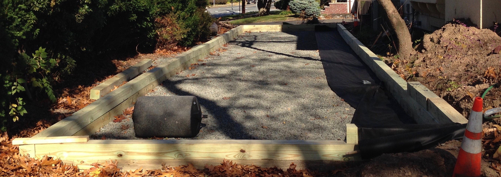

### Weed Barrier

I put down a weed barrier to try to prevent weeds from growing up through the court. That seems to work, but it doesn't prevent weeds and grass from growing on the top surface of the court. 

Some people recommend using a layer of sand or smaller gravel to level out the base course of stone before installing the weed barrier, but I did not do that. 

I used a [3'-wide roll of landscaping fabric](https://amzn.to/2OkxkDe), overlapping each row a bit and then tacking them together with a staple gun. I paid about $50 for a 300' roll. 

### Playing Surface

My playing surface is agricultural limestone. Most people in my area would use crushed stone dust. I got the idea to use it from [this website](https://hubpages.com/sports/Bocce-Court-Construction), but I wouldn't necessarily recommend it in NJ. Like oyster shells, it's calcium carbonate, but it's a fine powder that takes a long time to dry. It also seems to be a great host for grass and weeds. 

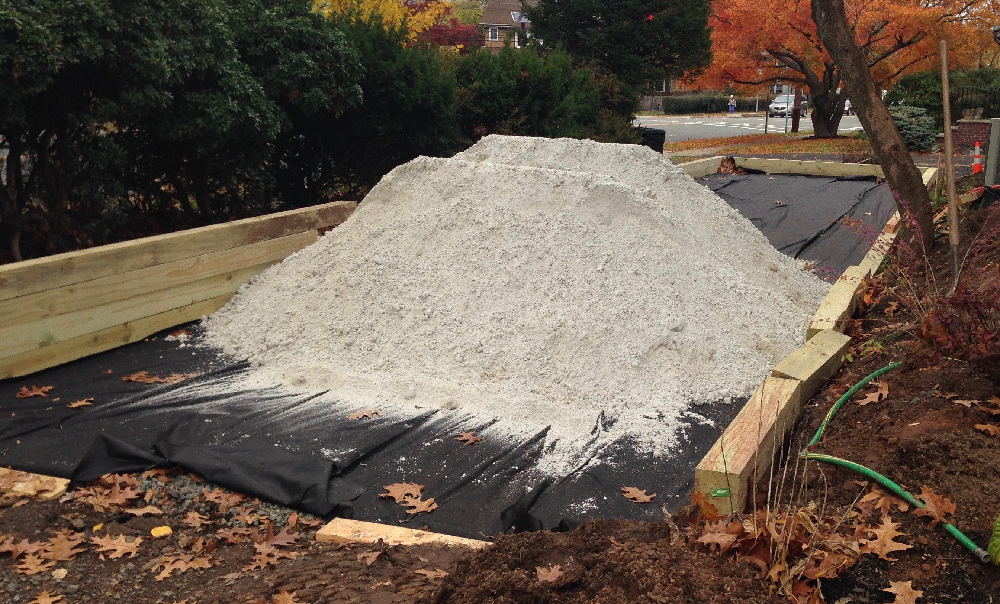

It would have been great to use oyster shells for the whole surface, but that's not affordable in my area. 

Clay, decomposed granite, stone dust, fancy tennis court clay, or even sand are other options. And of course you can also play on short grass or dirt. 

8 cubic yards of aglime (12' x 55' x 4") is 12 tons (1.5 tons/yard). It was $30/ton plus tax and $100 for delivery, totaling just about $500. Stone dust is about half the price per ton. 

Each year, I put down about 1000 lb. of Oyster Shell in the form of [50-lb. bags of chicken feed from Tractor Supply](https://www.tractorsupply.com/tsc/product/manna-pro-oyster-shell-50-lb), at a cost of about $200. It makes the court less dusty and a little more fun to play on. 

#### Compacting

After spreading out the material, I compacted it by tamping down on it with a [cement rake](https://amzn.to/2C34Kjd) and then rolling over it with a [water-filled lawn roller](https://amzn.to/2NTwVZ7). 

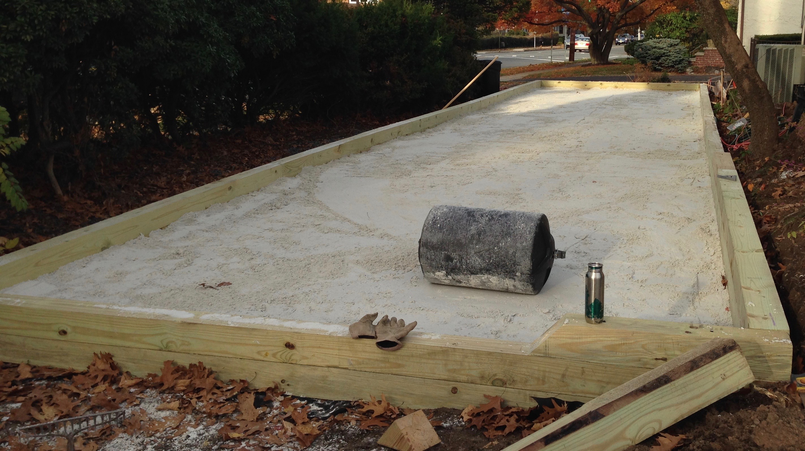

### Play!

The object of the game is to get your team's balls closer to the target ball than the opposing team's. 

These are [our house rules](bocce-rules.md). 

### Additions

#### Ball cabinet

This simple ball cabinet is made from 1/2" exterior-grade plywood, stained, and finished with polyurethane. It's attached to the house with a French cleat. 

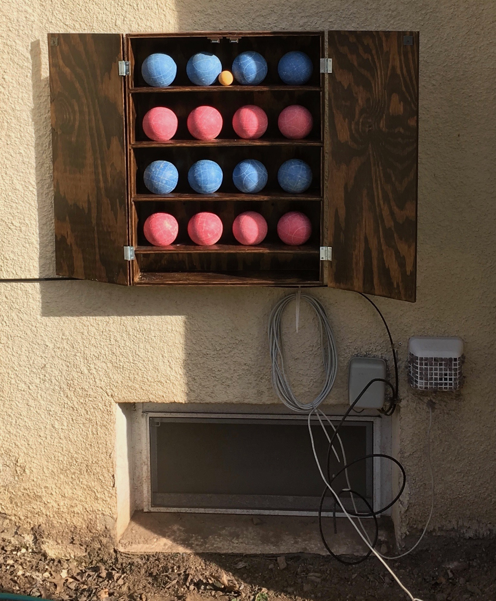

Each shelf has 4 holes drilled to keep the balls from rolling around. 

#### Lighting

Originally, I mounted flood lights on the tree that hung over the middle of the court. However, that tree eventually fell over in a snow storm. 

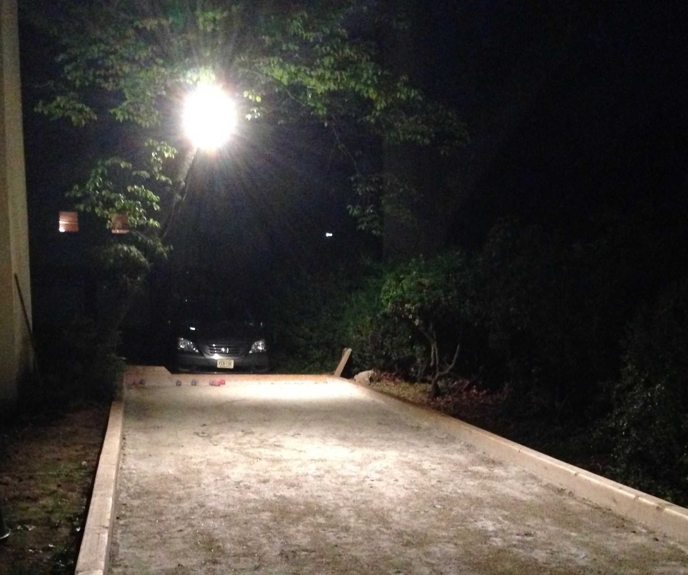

Inspired by [this article](http://brightjuly.blogspot.com/2012/09/diy-outdoor-string-lights.html), the court is currently lit with [LED string lights](https://www.costco.com/Feit-48'-LED-Filament-String-Light-Set.product.100405061.html). I would recommend using 1" conduit at each corner. You can see that the 3/4" conduit I'm using leans in. 1/2" is fine for the others. 

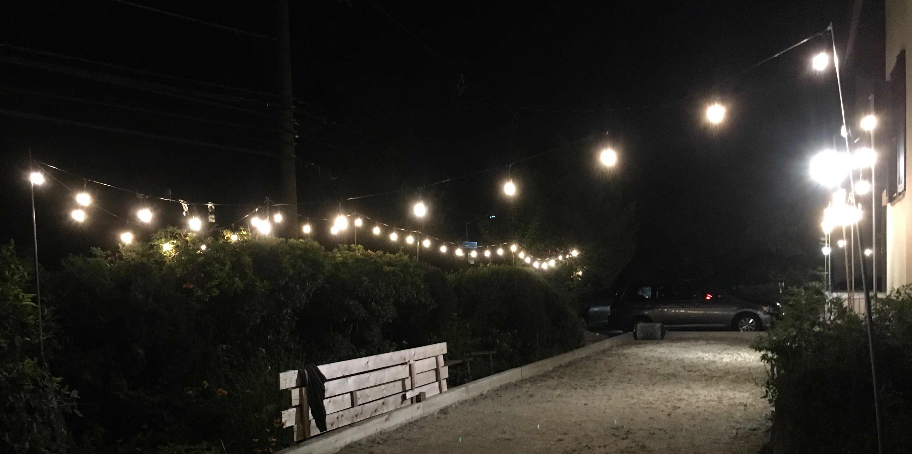

Because I had already done the wiring for the flood lights, I kept them and mounted the base to a cedar post. However, the string lights provide more than enough light for nighttime play. 

## Material Costs

Prices are from 2014 in Northern NJ and include tax and delivery. 

* 10 yards of 3/4 stone, delivered: $390
* 12 tons of aglime, delivered: $495
* (25) 12' pressure-treated 6x6s, delivered: $990
* 80' of 1/2" rebar: $34
* 300' x 3' [weed barrier](https://amzn.to/2OkxkDe): $53
* [8" TimberLOK screws](https://amzn.to/2Ol9CGF) (box of 50): $37
* (20) 50# bags of Oyster Shell: $200

Don't forget [the balls](https://amzn.to/2C1FkCk)! You don't need anything expensive. And when your kids launch the pallino (the target) out of the court and into the bushes, replace it with a golf ball. 

## Tools

As I said above, this project does not require a lot of tools, and you probably already have many of them. You don't necessarily need all of the tools in the list below, but these are the tools that I used, with approximate prices for common items. 

* Material handling
  * [Shovel](https://amzn.to/2PkQbv8) for clearing earth and spreading material: $20
  * Wheelbarrow for moving earth
  * [Cement rake](https://amzn.to/2C34Kjd) for spreading material and leveling the surface: $20
  * [Metal rake](https://amzn.to/2Rz4Ynu) for spreading material and leveling the surface: $20
  * [Lawn roller](https://amzn.to/2NTwVZ7) for compacting and leveling the surface: $103
* Woodworking
  * [drill](https://amzn.to/2ymaIIh)/[driver](https://amzn.to/2ymm27v) for attaching boards
  * [hammer](https://amzn.to/2C1K9vC) for driving rebar in rocky soil: $20
  * [circular saw](https://amzn.to/2IHGRyX) for cutting boards
  * [Speed square](https://amzn.to/2yhrnN2), a guide for making circular saw cuts: $8
  * [Router](https://amzn.to/2pFsKBi) for easing the edges of the border
  * [5/8 round-over router bit](https://amzn.to/2R6VJdU) for easing the edges of the border: $19
* Layout
  * [String](https://amzn.to/2NO4k7b): $14
  * [String level](https://amzn.to/2ypcU1B): $3
  * [Water level](https://amzn.to/2OroIui): $14
  * [100' tape measure](https://amzn.to/2OkRaOB): $12
* Safety
  * [Ear protection](https://amzn.to/2OZ2du3): $22
  * [Safety glasses](https://amzn.to/2NMfDNc): $7
  * [Respirator](https://amzn.to/2NsngU4) with [3M 2097](https://amzn.to/2C1Dh1c) cartridge: $24

If you happen to be removing part of a driveway, I'd also recommend these: 

 * [Masonry blades](https://amzn.to/2BYTTqt) for circular saw
 * [Bagsters](https://amzn.to/2Okz538) to dispose of asphalt
 * [Face shield](https://amzn.to/2xLc7sn): $13

I also made a [drag mat](https://amzn.to/2Nrwm3z) out of two [scraper door mats](https://amzn.to/2zWtAj2), 1/2" plywood, and rope.

### Investing in Tools

Buy tools as you need them for a project, not before. 

If you're going to do more DIY projects in the future, I would highly recommend a cordless (18-20V) drill and driver set, which can be had for under $100 if you look for a deal. 

Tools are mostly a tradeoff of money for time. A $20 corded drill with an extension cord will get the job done, and you just have to spend a little extra time alternating between a drill bit and a driver bit. 

Along those lines, you will pay more for raw materials if they're ready to use (or if the store cuts them for you). If you invest in tools to mill lumber (table saw, planer, jointer), you can buy cheaper rough lumber, but you won't get the payback until you do a lot of projects. 

## Lowering the Cost

This does not have to be an expensive project. I wanted to share my experience in detail, but you can spend a lot less to achieve a similar result. 

First, you can play on grass or any other surface. The surface doesn't even have to be level. In fact, that can make the game less predictable and more fun. 

Instead of 6x6 timbers, you could use cheap landscape timbers that are set on top of the ground, which would cost about $175 instead of $1000. You can use half the lumber and only play in one direction. 

If you let the lumber yard or hardware store cut your lumber, the only tool you really need is a drill, which is something you should own anyway. A capable corded drill should cost $30 or less. 

If you decide to invest in a playing surface, you can use cheaper materials like stone dust. 

## Other Resources

I relied on many resources to plan and build my own court. 

* [Budget Bocce Court](https://www.kobo.com/us/en/ebook/budget-bocce-court) ebook
* [Court specs](http://www.boccestandardsassociation.org/BocceCourtSpecification.pdf) from Har-Tru
* [Another DIY court](http://benvenutobaci.hubpages.com/hub/Bocce-Court-Construction)
* [Another method](http://books.google.com/books?id=RVi5vYo9_BgC&pg=PA106&lpg=PA106&dq=bocce+court+layers&source=bl&ots=WcRmbsCUAR&sig=4eZ0TT_o0ABh26zArOAXfOIcvYk&hl=en&sa=X&ei=t9-9U_LrB9emyASdhIDYCw&ved=0CHUQ6AEwDw#v=onepage&q=bocce%20court%20layers&f=false) for building the border 
* A [discussion about surface materials](http://forums2.gardenweb.com/forums/load/design/msg042231567215.html?1)
* [Popular Mechanics article](https://www.popularmechanics.com/home/how-to-plans/a16485/how-to-build-a-backyard-bocce-ball-court/) on building a bocce court

### OpenSCAD volume calculator	

If you're super nerdy, you can use this [OpenSCAD model](bocce-court.scad) to estimate material volumes. 

## Other Additions

There are a few other additions I've made that are particular to our situation. 

### Retractable Gaga Ball Pit

[Gaga ball](https://youtu.be/-qxFzAmkFG8) is a game my kids enjoy, so we added the option to play Gaga on the bocce court. It's just two sets of cedar "fences" connected with hinges. When we're not playing gaga ball, it folds away. There are also some base pieces that keep the ball from escaping. 

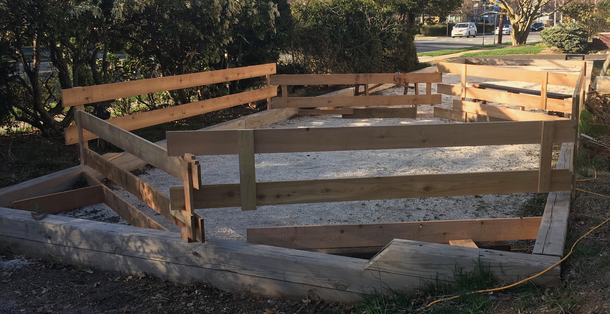

### Hiding Garbage

To hide our garbage cans and air conditioning condensors, I built a cedar fence with removable panels. 

There's a gate on the left where we keep our garbage cans. The other four sections of fence are all panels that are attached to the posts with 2x4 joist hangers. Each one can be lifted up and out so that the air conditioning equipment can be serviced. 